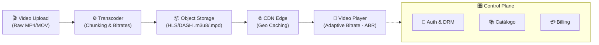

# Streaming & Trade-offs
### Monolito vs. Microsserviços em Sistemas de Vídeo

  Exercício 5 — Arquitetura de Software

  Análise de Atributos de Qualidade & Decisão Arquitetural

---
layout: default
---

# System Design: Como Funciona o Streaming?

Arquitetura de processamento e distribuição de vídeo sob demanda (VOD) e Live.

  

    <b>1. Ingestão & Chunking</b> 
    Quebra do vídeo bruto em fragmentos temporais de 2s a 6s.
  

  

    <b>2. Multi-bitrate Encoding</b> 
    Gera resoluções (1080p, 720p, 480p) e manifestos HLS/DASH.
  

  

    <b>3. Distribuição & ABR</b> 
    CDN aproxima os chunks; player adapta a qualidade dinamicamente.
  

---
layout: default
---

# O Dilema Arquitetural (Exercício 5)

Como estruturar o software de uma plataforma com cargas tão heterogêneas?

### 🏛️ Opção A: Monolito Único
* Base de código unificada (Auth + Catálogo + Billing + Ingestão).
* Processo único de execução e banco de dados centralizado.
* **Vantagem**: Fácil de desenvolver, depurar e testar.
* **Gargalo**: Reimplantação total a cada modificação.

### 🧩 Opção B: Microsserviços
* Serviços isolados por Bounded Context (*Transcoder*, *Catalog*, *Auth*).
* Bancos de dados descentralizados e comunicação via rede/mensageria.
* **Vantagem**: Escalar componentes de forma independente.
* **Gargalo**: Complexidade operacional, observabilidade e rede.

---
layout: default
---

# (a) Atributos Favorecidos: Opção A (Monolito)

O Monolito prioriza coesão de ciclo de vida e simplicidade de desenvolvimento.

  <h4 class="text-blue-600 font-bold">🧪 Testabilidade (Testability)</h4>
  
Testes de ponta a ponta e integração rodam em processo (in-memory), sem necessidade de mocks distribuídos ou Testcontainers para cada microserviço.

  <h4 class="text-blue-600 font-bold">⚡ Desempenho Interno (Latency / Zero-Hop)</h4>
  
Comunicação intra-processo via chamadas de memória. Zero overhead de serialização (JSON/Protobuf), handshakes TLS e latência de rede entre módulos.

  <h4 class="text-blue-600 font-bold">🔒 Consistência de Dados (ACID)</h4>
  
Transações atômicas nativas no banco de dados. Elimina a necessidade de padrões complexos como Sagas, 2PC e reconciliação de consistência eventual.

  <h4 class="text-blue-600 font-bold">🛠️ Simplicidade Operacional (Operability)</h4>
  
Menor custo total de propriedade (TCO). Pipeline de CI/CD único, infraestrutura enxuta (1 cluster simples) e depuração local trivial.

---
layout: default
---

# (a) Atributos Favorecidos: Opção B (Microsserviços)

Microsserviços favorecem elasticidade diante de cargas assimétricas.

  <h4 class="text-emerald-600 font-bold">📈 Escalabilidade Granular (Resource Elasticity)</h4>
  
Escala elástica de workers CPU/GPU-bound de <i>Transcoding</i> durante picos de upload, sem precisar replicar o serviço leve de <i>Catálogo</i> ou <i>Auth</i>.

  <h4 class="text-emerald-600 font-bold">🛡️ Isolamento de Falhas (Availability / Bulkhead)</h4>
  
Uma falha ou estouro de memória no serviço de Recomendações ou Comentários não derruba o Core de Reprodução e Streaming de Vídeo.

  <h4 class="text-emerald-600 font-bold">🚀 Implantabilidade Independente (Deployability)</h4>
  
Squads realizam deploys contínuos em seus domínios (ex: 30x/dia no Catálogo) sem retestar ou recompilar o pipeline de encoding de vídeo.

  <h4 class="text-emerald-600 font-bold">🔧 Heterogeneidade Tecnológica (Modifiability)</h4>
  
Stack poliglota sob medida: C++/Rust + FFmpeg para transcoding de alta performance, Go/Node.js para APIs de streaming e Python para IA/Recomendação.

---
layout: default
---

# (b) O Principal Trade-off

O equilíbrio clássico entre **Complexidade Operacional** e **Elasticidade Granular**.

  

    Complexidade de Rede & Operação ⇄ Elasticidade de Recursos & Autonomia de Deploy
  

  <b>No Monolito paga-se em Acoplamento:</b>
  <ul class="list-disc ml-4 mt-2 space-y-1">
    <li>Deploy All-or-Nothing (risco concentrado).</li>
    <li>Ineficiência de hardware (instâncias infladas para abrigar encoding e web).</li>
    <li>Conflito de dependências entre times.</li>
  </ul>

  <b>Nos Microsserviços paga-se o "Microservice Premium":</b>
  <ul class="list-disc ml-4 mt-2 space-y-1">
    <li>Latência de rede adicional (Fallacies of Distributed Computing).</li>
    <li>Complexidade de observabilidade (Distributed Tracing, OpenTelemetry).</li>
    <li>Sobrecarga de infra (Kubernetes, Service Mesh, API Gateway, Sagas).</li>
  </ul>

---
layout: default
---

# (c) Cenários de Adequação Técnica

Critérios objetivos para direcionar a decisão arquitetural:

  <h3 class="text-blue-600 font-bold text-sm">Quando escolher a Opção A (Monolito)</h3>
  <ul class="text-xs space-y-2 mt-3">
    <li><b>Fase do Produto:</b> Startups, MVPs, plataformas corporativas internas ou validação de Product-Market Fit.</li>
    <li><b>Tamanho do Time:</b> Equipes pequenas a médias (< 15 engenheiros) trabalhando em um domínio em rápida evolução.</li>
    <li><b>Perfil de Carga:</b> Tráfego previsível, ou processamento de vídeo delegado a serviços gerenciados (ex: AWS MediaConvert / Mux).</li>
    <li><b>Foco:</b> Maximizar <i>Time-to-Market</i> e minimizar custos de infraestrutura e governança.</li>
  </ul>

  <h3 class="text-emerald-600 font-bold text-sm">Quando escolher a Opção B (Microsserviços)</h3>
  <ul class="text-xs space-y-2 mt-3">
    <li><b>Fase do Produto:</b> Plataformas em hiper-escala (ex: Netflix, Twitch) com milhões de visualizadores simultâneos (CCU).</li>
    <li><b>Estrutura Organizacional:</b> Múltiplos squads autônomos (Lei de Conway) por Bounded Context (Transcoding, DRM, Ads, Billing).</li>
    <li><b>Assimetria Extrema:</b> Ingestão/Transcoding massivo in-house exigindo clusters elásticos de GPUs dedicadas.</li>
    <li><b>Foco:</b> Resiliência de missão crítica (Zero-Downtime) e deploys desacoplados em alta frequência.</li>
  </ul>

---
layout: default
---

# Síntese & Recomendação Técnica

Na prática da engenharia de software moderna, a escolha não precisa ser binária.

  <h3 class="text-purple-600 dark:text-purple-300 font-bold text-sm">💡 Estratégia Recomendada: Modular Monolith + Async Workers</h3>
  

    Iniciar com um <b>Monolito Modular</b> bem estruturado para o Control Plane (Auth, Catálogo, Billing) e isolar apenas o gargalo computacional de <b>Transcoding/Ingestão</b> em workers assíncronos desacoplados por filas (Kafka/SQS).
  

  

    Conforme o produto ganha escala e múltiplos times, utiliza-se o padrão <b>Strangler Fig</b> para extrair serviços específicos sob demanda comprovada de carga e governança.
  

  
<b>1. Simplicidade Primeiro</b> Prove o valor do negócio

  
<b>2. Isole Gargalos Reais</b> Transcoding assíncrono

  
<b>3. Distribua com Dados</b> Evite distribuição prematura

